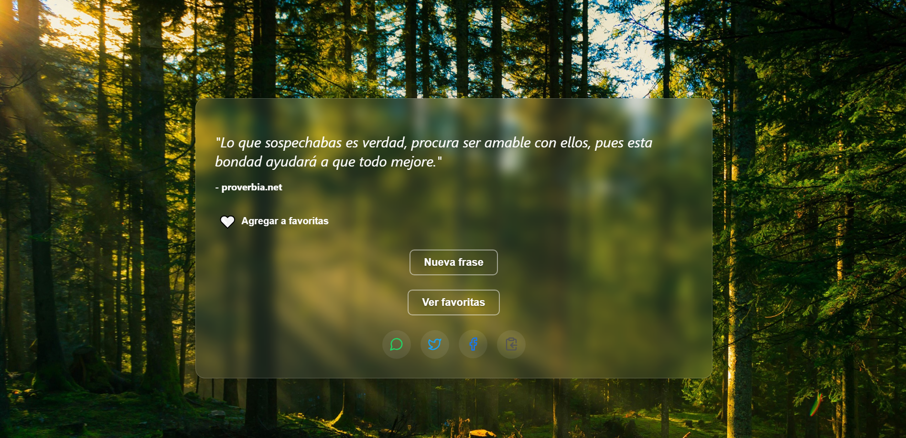

# 💬 Random Quote App

Una aplicación web desarrollada con **React** que muestra frases aleatorias acompañadas del autor. Puedes marcar tus frases favoritas, compartirlas por redes sociales y disfrutar de un diseño moderno con **glassmorphism** y animaciones suaves con **Framer Motion**.

## 🚀 Tecnologías utilizadas

- React + Vite
- Sass con metodología BEM
- Framer Motion
- localStorage
- Netlify

## 🌟 Características

- Genera frases aleatorias desde un archivo .json.
- Guarda y visualiza tus favoritas.
- Comparte frases por WhatsApp, Twitter o Facebook.
- Animaciones suaves y diseño moderno.
- Diseño responsive adaptable a móviles
- Responsive y amigable para dispositivos móviles.
- Loader personalizado SVG con animación de “montañas”

## 📸 Captura

## 🧠 Autor

Mauricio Guerrero  
[Portafolio](https://quotes-app-glass.netlify.app/)
